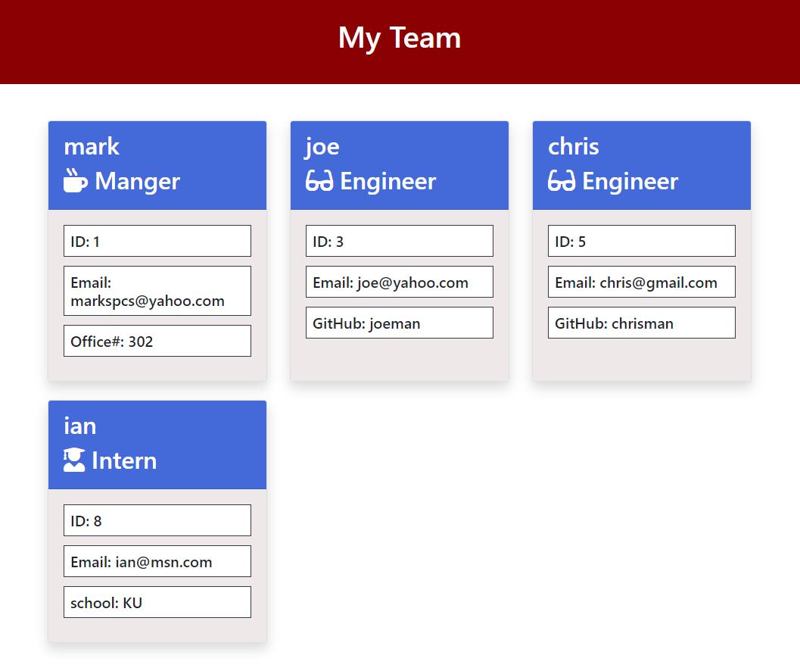

# Team Builder

## Description

This Node.js application uses the input during execution to buile a html page in the ./output directory call team.html

## Usage
execute by typing:
    node app.js

    at the prompt enter the information of your team. Once you have no more team members to add you press 'n'. This will then build the html code that you can then open in a browser under ./output/team.html
## Installation

Requires Inquirer, and Jest

## Credits

This program includes bootstrap from http://getbootstrap.com 
Also fontawsome from https://www.fontawesome.com

